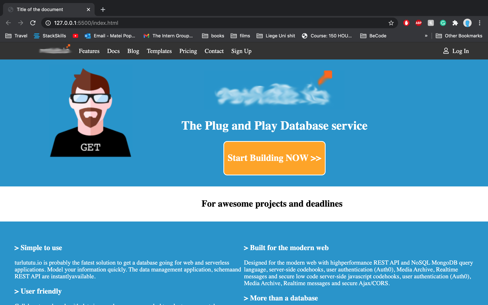
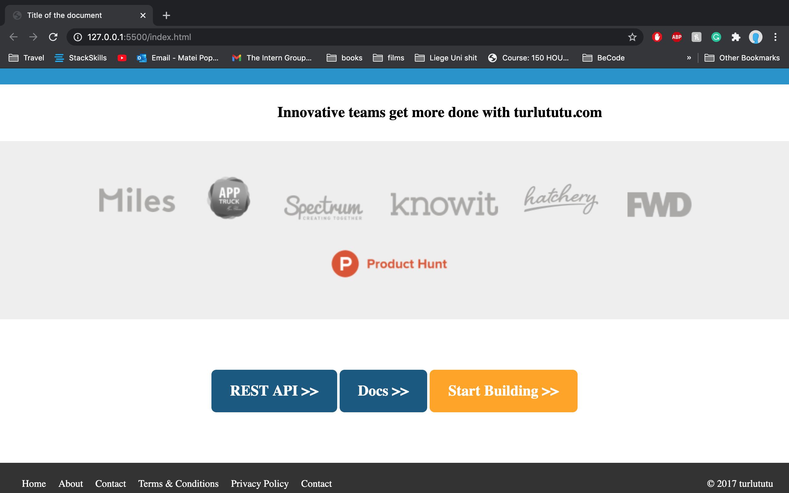

# **Home-page-of-turlututu**

by Matei Popescu

## What ?

Using a screenshot in the turlututu exercise instructions, we were asked to recreate the website in the screenshot using HTML and CSS.

This work has been done individually but I have also gotten help from my loyal group "Bandersnatch" or I used Google to look for solutions on the internet.

 
## When did i work on it ?

The Work was given on Monday 28th october and I finished it on Monday bacause i had another work :[Doc-The-Chinese-Farmer](https://sifedine-hajji.github.io/Progressive-Enhancement/). I recently refined it.

## What does it look like ?

Here is the direct link to the site I made [Homepage of Turlututu](https://github.com/mattiepops/turlututu.git) to get a final rendering of the work.

#### **Here are some screenshots of the awesome website** :

## License

© Matei Popescu 2020